# Netflix Data Analysis

## Project Overview

This project performs **Exploratory Data Analysis (EDA)** on the Netflix Titles dataset using **Python**. The goal is to clean the data, analyze trends, visualize patterns, and extract meaningful insights about Netflix's catalog of movies and TV shows.

The project covers the complete data analysis workflow, including data cleaning, feature engineering, visualization, and interpretation of results.

---

## Objectives

- Perform data cleaning and preprocessing
- Handle missing values and inconsistent data
- Explore the distribution of Netflix content
- Analyze trends in content releases and additions
- Identify top producing countries, genres, directors, and actors
- Generate meaningful business insights through visualizations

---

## Dataset

The dataset contains information about Netflix movies and TV shows, including:

- Show ID
- Title
- Type (Movie / TV Show)
- Director
- Cast
- Country
- Date Added
- Release Year
- Rating
- Duration
- Genre
- Description

---

## Technologies Used

- Python
- Pandas
- NumPy
- Matplotlib
- Seaborn
- Jupyter Notebook

---

## Project Structure

```
Netflix-Data-Analysis/
│
├── data/
│   ├── netflix_titles.csv
│   └── netflix_titles_cleaned.csv
│
├── notebooks/
│   └── netflix_data_analysis.ipynb
│
├── images/
│   ├── actor_distribution.png
│   ├── content_distribution.png
│   ├── content_duration_distribution.png
│   ├── content_ratings.png
│   ├── content_release_trend.png
│   ├── content_release_trend_last_25_years.png
│   ├── country_production.png
│   ├── director_distribution.png
│   ├── distribution_tv_shows_seasons.png
│   ├── genre_distribution.png
│   ├── movies_vs_tv_shows.png
│   ├── movies_vs_tv_shows_by_country.png
│   └── titles_added_by_month.png
│
└── README.md
```

---

# Data Cleaning

The following preprocessing steps were performed:

- Removed duplicate records
- Handled missing values
- Converted `date_added` to datetime format
- Extracted year, month, and day from `date_added`
- Split the `duration` column into duration value and duration unit
- Cleaned categorical columns for analysis

---

# Exploratory Data Analysis

The following analyses were performed:

- Distribution of Movies vs TV Shows
- Content Ratings Analysis
- Content Release Trend
- Content Release Trend (Last 25 Years)
- Top Producing Countries
- Genre Distribution
- Director Distribution
- Actor Distribution
- Movie Duration Distribution
- TV Show Seasons Distribution
- Titles Added by Month
- Movies vs TV Shows by Country

---

# Visualizations

## 1. Movies vs TV Shows

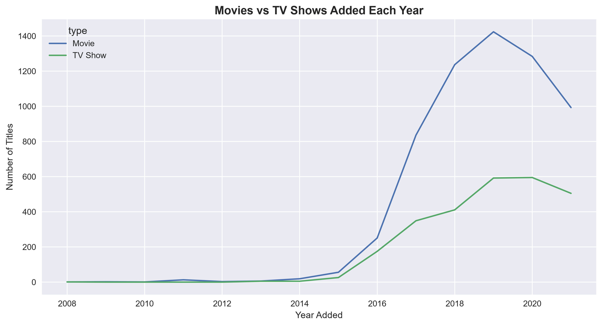

---

## 2. Content Distribution

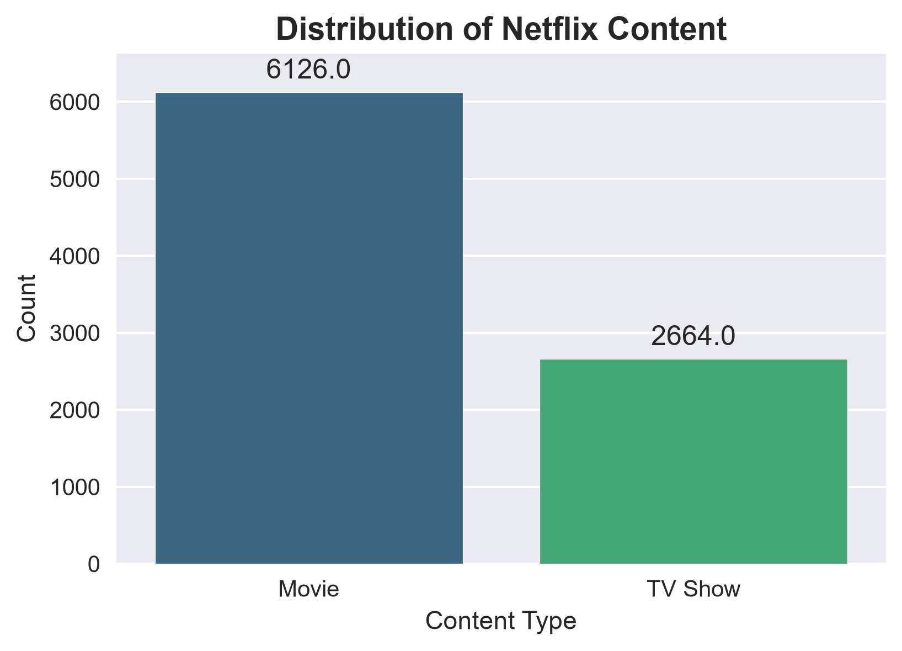

---

## 3. Content Ratings

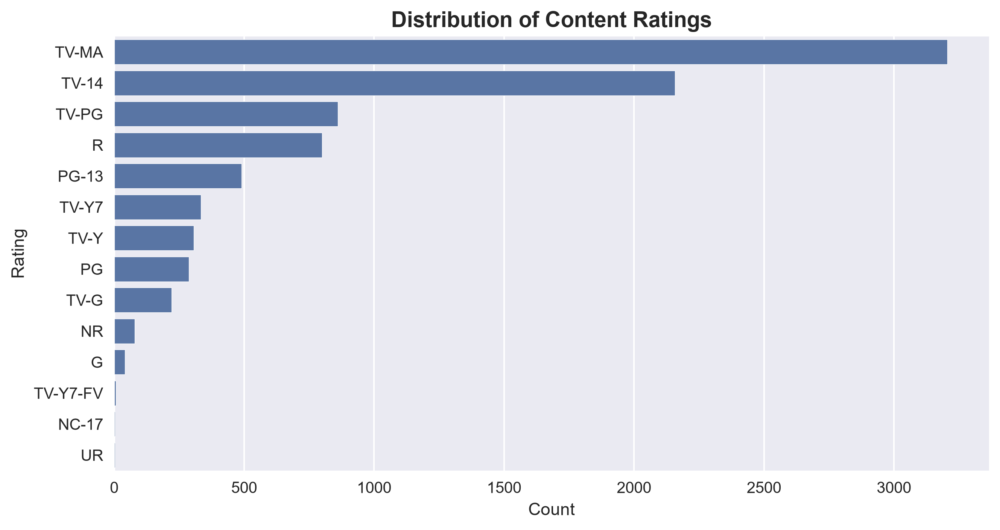

---

## 4. Content Release Trend

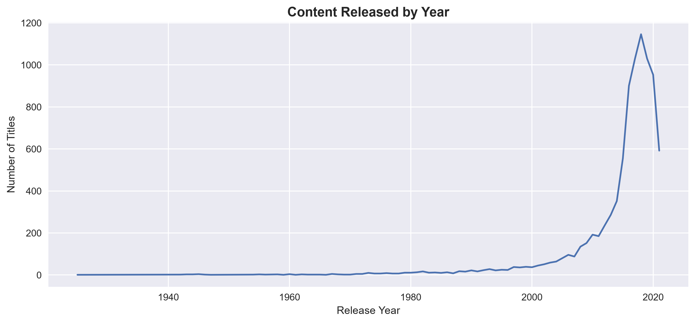

---

## 5. Content Release Trend (Last 25 Years)

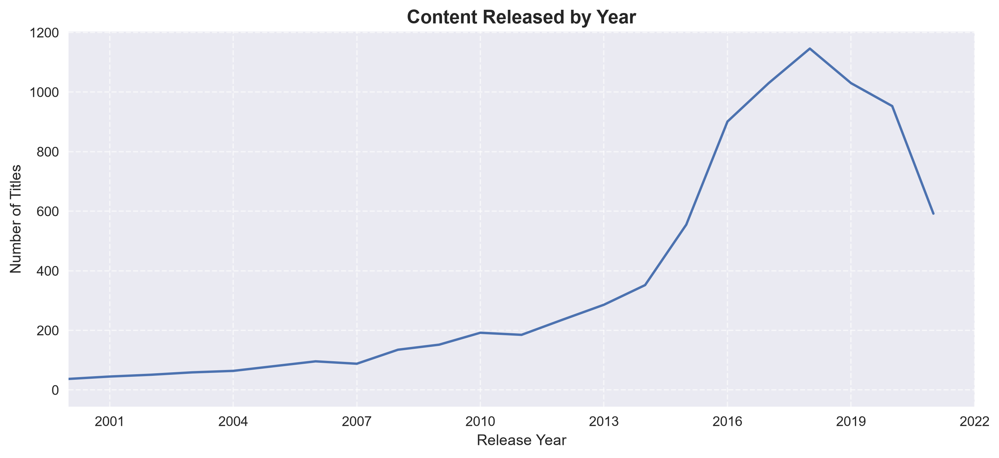

---

## 6. Country Production

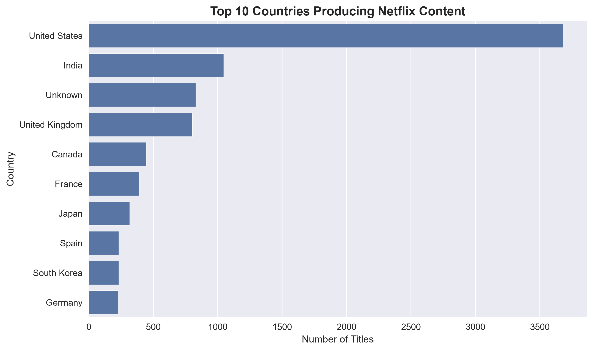

---

## 7. Genre Distribution

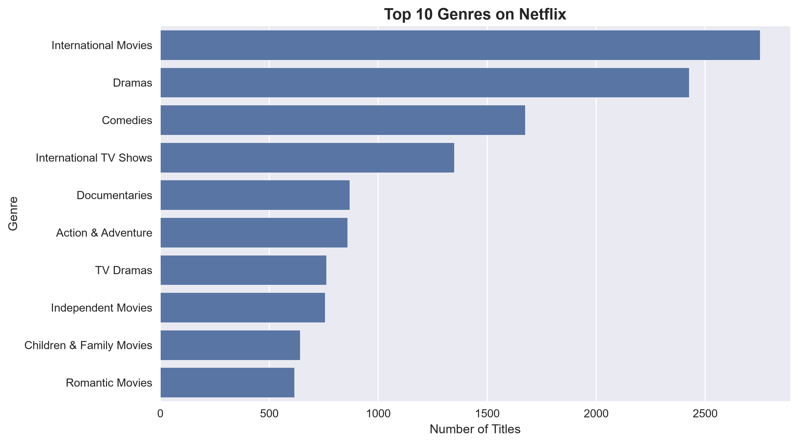

---

## 8. Director Distribution

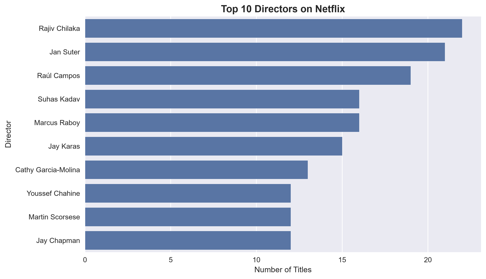

---

## 9. Actor Distribution

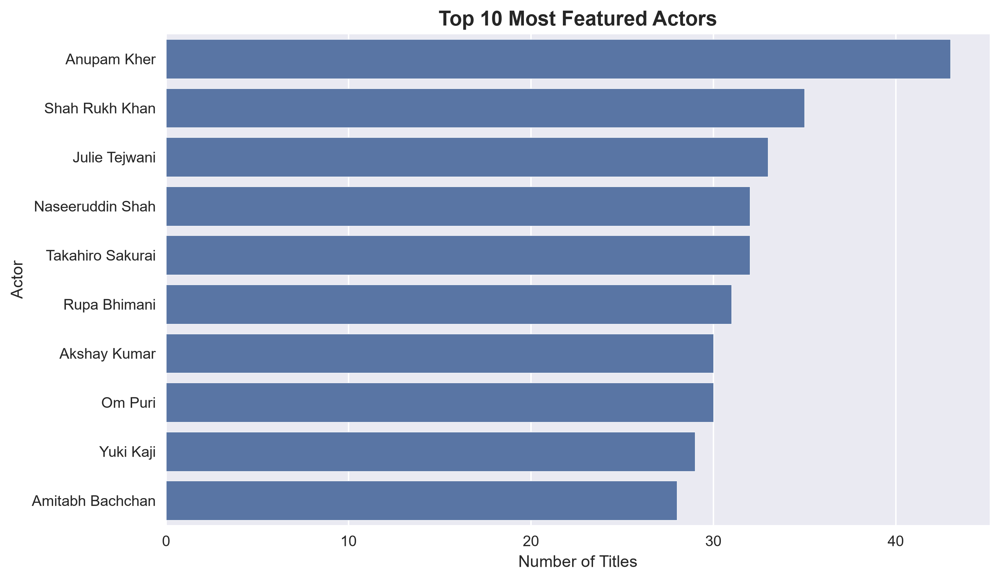

---

## 10. Movie Duration Distribution

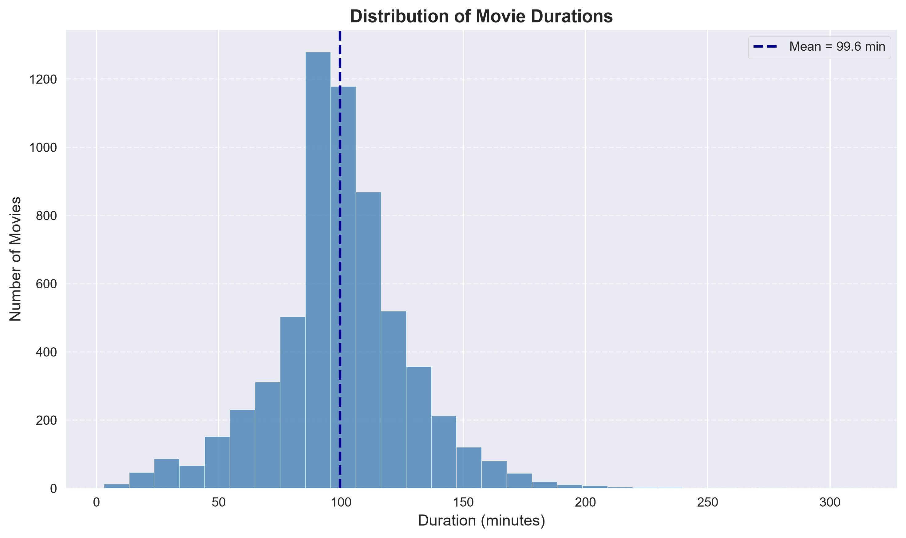

---

## 11. TV Show Seasons Distribution

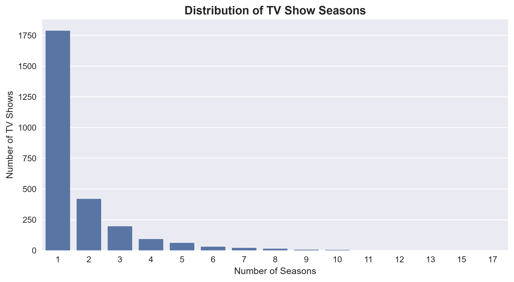

---

## 12. Titles Added by Month

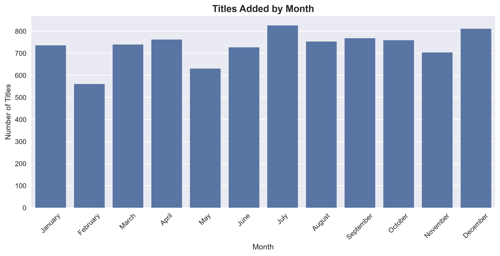

---

## 13. Movies vs TV Shows by Country

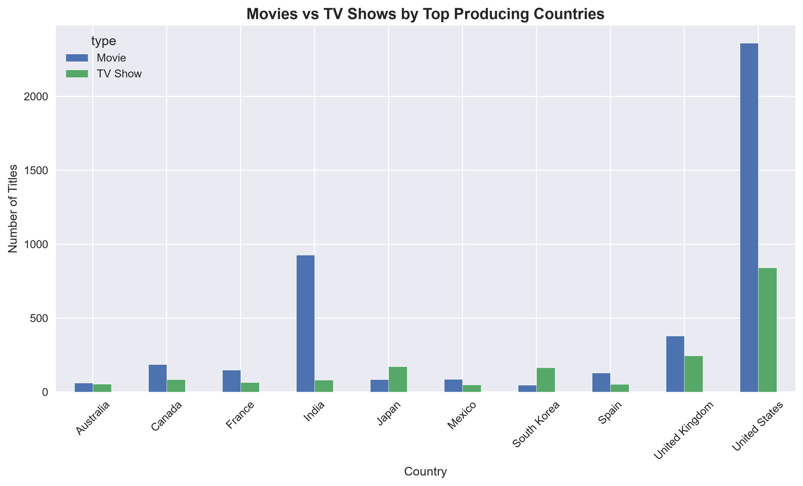

---

# Key Insights

- Movies significantly outnumber TV Shows in Netflix's catalog.
- Most Netflix content is rated **TV-MA**, indicating a strong focus on mature audiences.
- The number of released titles increased rapidly after the early 2000s.
- Netflix experienced substantial growth in content additions between 2016 and 2019.
- The United States is the largest producer of Netflix content, followed by India.
- International Movies and Dramas are among the most common genres.
- Most TV Shows consist of only one season.
- Most Netflix movies have a runtime between 80 and 120 minutes.

---

# Conclusion

This project demonstrates a complete Exploratory Data Analysis workflow using Python. Through data cleaning, feature engineering, and visualization, valuable insights were extracted regarding Netflix's content library, production trends, genres, ratings, and viewing patterns. The project highlights practical data analysis skills and serves as a strong portfolio project for aspiring Data Analysts and Data Scientists.

---

## Author

**Sami Mirza**

Electrical Engineering Student | Aspiring AI & Machine Learning Engineer
